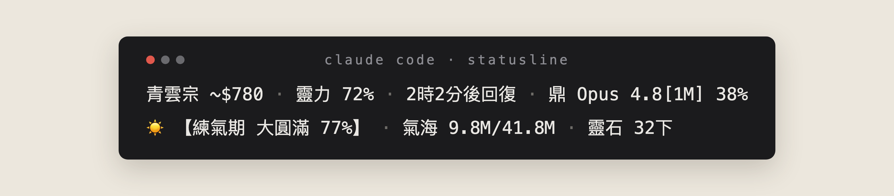
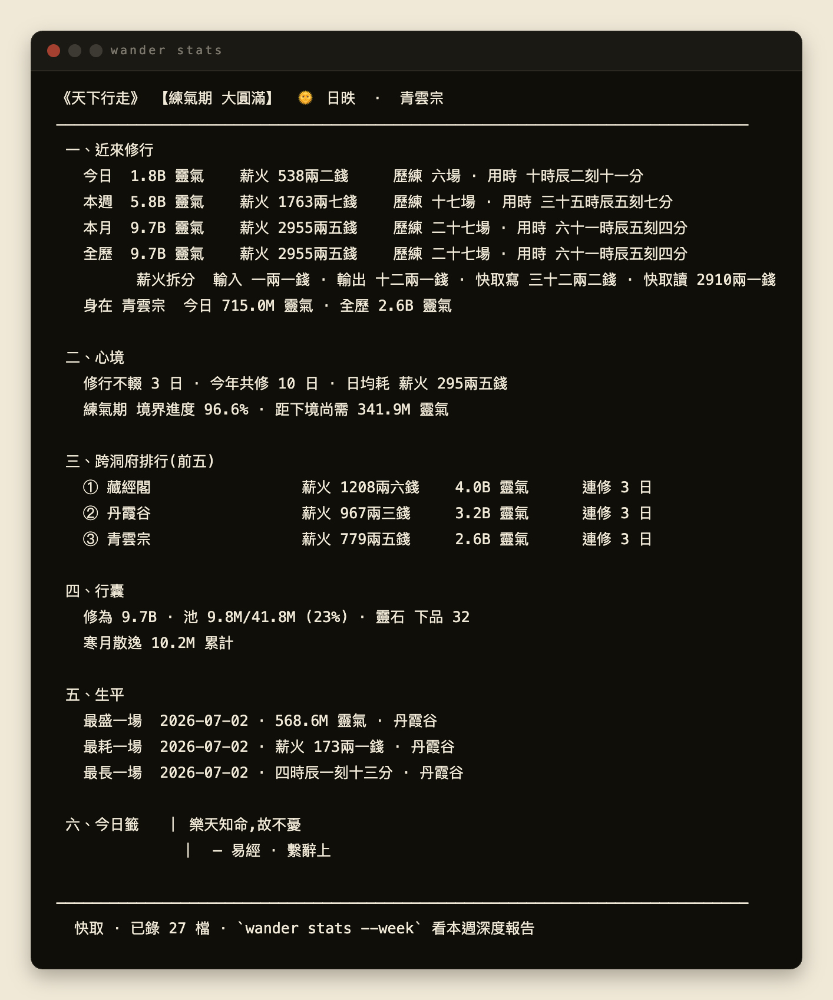

```
╦ ╦╔═╗╔╗╔╔╦╗╔═╗╦═╗
║║║╠═╣║║║║║║╠╣ ╠╦╝
╚╩╝╩ ╩╝╚╝═╩╝╚═╝╩╚═
天下行走 · Claude Code
```

# wander

> 「遊於藝,志於道」— 把 Claude Code 的 token 用量,化作一場修行。

🌐 **繁體中文** · [English ↓](#wander-english)

**wander** 是一個**本機**的 Claude Code 用量工具:你的 token 不再是冰冷的數字,而是**靈氣**、**修為**、**境界**、**靈石**。

- **不調用 API、不上傳任何資料** — 所有計算 100% 在你的機器上
- **macOS**(Apple Silicon / Intel)+ **Windows x64**
- 需要已安裝 Claude Code(`~/.claude/projects/` 有 transcript)

  



---

## 安裝

```bash
curl -fsSL https://raw.githubusercontent.com/wander-dao/wander/main/install.sh | bash
```

打開 Claude Code,status bar 即自動建立修行紀錄並顯示你的修行狀態(境界 / 氣海 / 靈石 / 靈力 / 洞府)——首次顯示【未入門】,片刻自亮,之後亦會自行保持最新。
**`wander stats` 等指令是深潛用的全景視圖,status bar 不依賴它。**

<details>
<summary>其他安裝方式:保留自己的 statusline / Windows / 疑難排解</summary>

**已有自訂 statusline、不想被改動** — 加 `--no-statusline`(只裝 binary,不動 settings.json):

```bash
curl -fsSL https://raw.githubusercontent.com/wander-dao/wander/main/install.sh | bash -s -- --no-statusline
```

**Windows x64** — PowerShell 一行(下載、入 PATH、接線 statusline):

```powershell
irm https://raw.githubusercontent.com/wander-dao/wander/main/install.ps1 | iex
```

指定版本 / 解除:`iex "& { $(irm https://raw.githubusercontent.com/wander-dao/wander/main/install.ps1) } -Version v0.1.0"`,同式 `-Uninstall`;離線可先下載 zip 再 `-ZipPath` 餵入;`-NoStatusline` 作用同 macOS。資料存於 `%USERPROFILE%` 下(與 macOS 同一佈局)。Windows 版未經大量實機驗證,遇到問題請開 issue。

**疑難排解**

- `~/.local/bin` 需在 PATH 中 — installer 會檢查並提示如何加入
- macOS **手動**下載 tar.gz(未經 installer)遇「無法驗證開發者」時,執行一次
  `xattr -d com.apple.quarantine ~/.local/bin/wander`(binary 未簽名/未公證,此警告屬預期;curl 安裝已自動處理,不會遇到)

</details>

---

## 玩法

status bar 是觀察層;打指令,才進入修真。

```
token ──→ 靈氣 ──→ 氣海 ──┬── 煉化 ──→ 修為 ──→ 境界
                          └── 壓縮 ──→ 靈石(貨幣)
              池滿不理 ──→ 散落寒月
```

```bash
wander stats        # 修行全景:境界 / 今日 / 本週 / 跨洞府 / 行囊 / 籤語⋯
wander bag          # 行囊:修為 / 靈氣池 / 靈石
wander cultivate    # 煉化全池靈氣 → 修為(推進境界)
wander compress     # 把靈氣壓成靈石(儲備貨幣)
wander --help       # 所有指令
```

池滿不想操心?設定一次,之後自動:`wander config set autoMode cultivate`

薪火(USD 成本)與靈力(5 小時配額)是純觀察,不進入 game loop。


*示意畫面(虛構資料)*

**機理、策略、境界門檻、全部指令與旗標 → [修行手冊](handbook/README.md)**

---

## 隱私

- **不調用任何 API**(包括 Anthropic admin)
- **不上傳、不追蹤** — 所有計算都在你電腦本機完成
- 結果只落在本機三層資料(永久 archive / 可重建 cache / 你的 config)— **任何內容都不會離開你的電腦**
- 資料佈局與備份 → [手冊卷五](handbook/05-觀測.md)

---

## 更新與解除安裝

```bash
wander upgrade      # 手動升級:只連 GitHub 取新版並核對無誤,不會自動更新、不回報任何東西
wander uninstall    # 互動式;預設保留修行紀錄與設定,再裝可續
```

不想用指令?重跑上面安裝那一行,同樣升到最新。

<details>
<summary>沒裝 CLI / 偏好用 installer 解除</summary>

```bash
curl -fsSL https://raw.githubusercontent.com/wander-dao/wander/main/install.sh | bash -s -- --uninstall
```

加 `--clean-statusline` 一併清掉 settings.json 的 statusLine 區塊(只清 wander 自己的)。
或最直接:`rm ~/.local/bin/wander`,再手動刪 settings.json 的 `statusLine` 區塊。
以上任一路徑,修行紀錄(`~/.local/share/wander/`)都保留 — 只有明示 `--purge` 才會刪。

</details>

---

## 授權

© 2026 conanhazelnut。採用 [**PolyForm Strict License 1.0.0**](LICENSE)。

- ✅ **個人 / 非商業免費使用**(hobby、學習、看自己的用量)
- ❌ 不得修改、逆向、再分發 / rehost binary
- ❌ 商業使用(公司部署等)需另行授權 — 請聯絡作者

---
---

# wander (English)

> "Wander in the arts, aspire to the Way" — turn your Claude Code token usage into a cultivation journey.

🌐 [中文 ↑](#wander) · **English**

**wander** is a **local-only** Claude Code usage tool: your tokens are no longer cold numbers, but **靈氣 (Qi)**, **修為 (Cultivation)**, **境界 (Realms)** and **靈石 (Spirit Stones)**.

- **No API calls, nothing uploaded** — 100% of the computation happens on your machine
- **macOS** (Apple Silicon / Intel) + **Windows x64**
- Requires Claude Code installed, with transcripts under `~/.claude/projects/`


---

## Install

```bash
curl -fsSL https://raw.githubusercontent.com/wander-dao/wander/main/install.sh | bash
```

Open Claude Code and the status bar builds your record on its own and shows your cultivation state (realm / Qi Sea / stones / mana / project) — a brief 【未入門】 first, then it lights up and keeps itself current.
**Commands like `wander stats` are the deep-dive views; the status bar does not depend on them.**

<details>
<summary>Other install paths: keep your own statusline / Windows / troubleshooting</summary>

**Already have a custom statusline you don't want touched** — add `--no-statusline` (installs the binary, leaves settings.json alone):

```bash
curl -fsSL https://raw.githubusercontent.com/wander-dao/wander/main/install.sh | bash -s -- --no-statusline
```

**Windows x64** — one PowerShell line (downloads, adds to PATH, wires the statusline):

```powershell
irm https://raw.githubusercontent.com/wander-dao/wander/main/install.ps1 | iex
```

Pin a version / uninstall: `iex "& { $(irm https://raw.githubusercontent.com/wander-dao/wander/main/install.ps1) } -Version v0.1.0"`, same form with `-Uninstall`; offline, download the zip first and feed it via `-ZipPath`; `-NoStatusline` works like on macOS. Data lives under `%USERPROFILE%` (same layout as macOS). Not extensively tested on real hardware — please open an issue if something breaks.

**Troubleshooting**

- `~/.local/bin` must be on your PATH — the installer checks and tells you how
- macOS "cannot verify developer" after a **manual** tarball download (bypassing the installer): run once
  `xattr -d com.apple.quarantine ~/.local/bin/wander` (the binary is unsigned / un-notarized, so the warning is expected; the curl install already handles this)

</details>

---

## Play

The status bar is the observation layer; type a command to enter cultivation.

```
tokens ──→ Qi ──→ Qi Sea ──┬── refine ────→ Cultivation ──→ Realm
                           └── compress ──→ Spirit Stones (currency)
            full & untended ──→ lost to the Cold Moon
```

```bash
wander stats        # panorama: realm / today / week / projects / bag / oracle …
wander bag          # bag: Cultivation / Qi pool / stones
wander cultivate    # refine the whole pool → Cultivation (push your realm)
wander compress     # compress Qi into Spirit Stones (bank currency)
wander --help       # all commands
```

Pool full and you'd rather not tend it? Set once: `wander config set autoMode cultivate`

薪火 (Kindling — USD cost) and 靈力 (Mana — the 5-hour quota) are observation-only — they never enter the game loop.


*Illustrative output (fictional data)*

**Mechanics, strategy, realm thresholds, every command and flag → [Handbook](handbook/en/README.md)** — the UI speaks Chinese; the handbook glosses every name it uses.

---

## Privacy

- **No API calls** (not even Anthropic admin)
- **No uploads, no telemetry** — 100% local computation
- Results land only in three local layers (permanent archive / rebuildable cache / your config) — **nothing ever leaves your computer**
- Data layout & backup → [Handbook V](handbook/en/05-observe.md)

---

## Update & Uninstall

```bash
wander upgrade      # manual upgrade: fetches the binary from GitHub only, SHA256-verified, never automatic, no telemetry
wander uninstall    # interactive; keeps your practice record + settings by default — reinstall and continue
```

Prefer no commands? Re-running the install one-liner also updates to the latest.

<details>
<summary>No CLI on PATH / prefer the installer</summary>

```bash
curl -fsSL https://raw.githubusercontent.com/wander-dao/wander/main/install.sh | bash -s -- --uninstall
```

Add `--clean-statusline` to also strip the statusLine block from settings.json (only if it's wander's).
Or simply `rm ~/.local/bin/wander` and hand-edit the `statusLine` block out of settings.json.
Every path above keeps your practice record (`~/.local/share/wander/`) — only an explicit `--purge` deletes it.

</details>

---

## License

© 2026 conanhazelnut. Licensed under the [**PolyForm Strict License 1.0.0**](LICENSE).

- ✅ **Free for personal / noncommercial use** (hobby, study, viewing your own usage)
- ❌ No modifying, reverse-engineering, redistributing, or rehosting the binaries
- ❌ Commercial use (e.g. company-wide deployment) requires a separate license — contact the author
